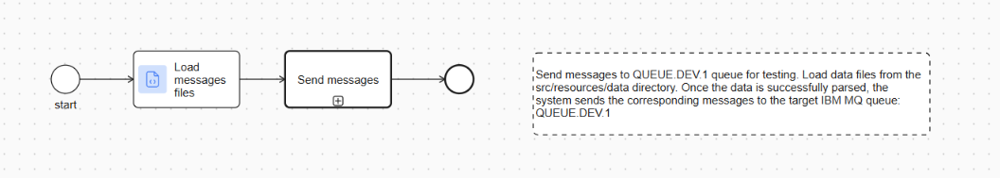
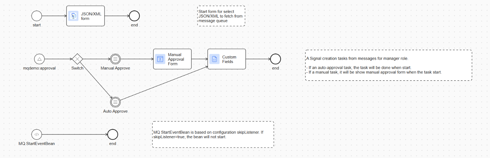

# IBM MQ Connector

The IBM MQ Connector lets Axon Ivy processes connect to IBM MQ queues for reliable message exchange. It supports both outbound message sending and inbound message retrieval, so you can build queue-based workflows without custom integration code.

**Key features**
- Send IBM MQ messages directly from your Axon Ivy processes.
- Retrieve queued messages and route them back into your business workflows.
- Reuse the connector through callable subprocesses for consistent message handling.
- Use demo implementations that show how to push and process messages end to end.
- Integrate queue-based approvals and event handling into your existing process models.
- Keep the integration simple with reusable connector logic and a lightweight setup flow.

## Demo

Use the built-in demo modules to see how queue-based messaging fits into an Axon Ivy application. The demos show how a message can be prepared, sent to IBM MQ, and processed by a follow-up workflow.

### Demo Workflows

#### ibm-mq-connector-demo
##### Initial Messages



1. Launch the initial messages demo from the demo menu.
2. Review the sample message payload that is loaded for the queue flow.
3. Send the prepared message through the connector.
4. Confirm that the process completes and the message is delivered as expected.

##### Loan Request Processing Demo




1. Launch the loan request processing demo from the demo menu.
2. Follow the approval flow and review the request details presented in the dialog.
3. Continue through the manual or automatic approval steps.
4. Confirm the resulting task and message handling status.

## Setup

- **Roles:** Manager (configured in config/roles.xml)
- **OpenAPI:** No information was delivered for this section.

1. Setup IBM MQ docker
   - Go to `ibm-mq-connector-demo/docker`
   - Update username, password in `Dockerfile`
   - Run `docker-compose up --build`
   - Open link: https://localhost:9443/ibmmq/console
2. Configure the IBM MQ connection details and queue names in the application variables for your environment.
3. Deploy the connector module and ensure the demo modules are available in your Axon Ivy workspace.
4. Run one of the demo processes to verify that messages can be sent and retrieved successfully.
5. Review the results in your process model and adjust queue names or message content as needed.

### Variables

```
@variables.yaml@
```

## Components

### Callable Subprocesses

#### MessageManagement.p.json

- **Signature**: fetch(com.axonivy.connector.model.MessageFetchRequest messageFetchRequest) -> messageFetchResult: com.axonivy.connector.model.MessageFetchResult
    - Input:
        - `messageFetchRequest` (com.axonivy.connector.model.MessageFetchRequest) - Message fetch request data
    - Result:
        - `messageFetchResult` (com.axonivy.connector.model.MessageFetchResult) - Message fetch result data

- **Signature**: send(com.axonivy.connector.model.MessagePushRequest messagePushRequest)
    - Input:
        - `messagePushRequest` (com.axonivy.connector.model.MessagePushRequest) - Message payload to send
    - Result: (none)

### Dialog Components

- For this market extension we do not provide any dialog components.

### Rest Clients

- For this market extension we do not provide any rest clients.

### Web Services

- For this market extension we do not provide any web services.

### Maven Artifacts

1. ibm-mq-connector

```xml
<dependency>
  <groupId>com.axonivy.connector.imb.mq</groupId>
  <artifactId>ibm-mq-connector</artifactId>
  <type>iar</type>
</dependency>
```

2. ibm-mq-connector-demo

```xml
<dependency>
  <groupId>com.axonivy.connector.imb.mq</groupId>
  <artifactId>ibm-mq-connector-demo</artifactId>
  <type>iar</type>
</dependency>
```